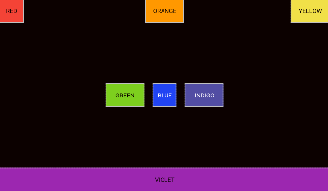

### 1.线性布局实验


####  activity_main.xml

```
<?xml version="1.0" encoding="utf-8"?>
<LinearLayout xmlns:android="http://schemas.android.com/apk/res/android"
    android:layout_width="match_parent"
    android:layout_height="match_parent"
    android:background="@color/colorBlack"
    android:orientation="vertical">
    <LinearLayout
        android:layout_width="match_parent"
        android:layout_height="wrap_content">

        <Button
            android:layout_width="wrap_content"
            android:layout_height="wrap_content"
            android:id="@+id/btn1"
            android:text="@string/One_One"
            android:background="@color/colorBlack"
            android:textColor="@color/colorWhite" />

        <Button
            android:layout_width="wrap_content"
            android:layout_height="wrap_content"
            android:id="@+id/btn2"
            android:layout_weight="1"
            android:text="@string/One_Two"
            android:background="@color/colorBlack"
            android:textColor="@color/colorWhite"/>
        <Button
            android:layout_width="wrap_content"
            android:layout_height="wrap_content"
            android:id="@+id/btn3"
            android:text="@string/One_Three"
            android:background="@color/colorBlack"
            android:textColor="@color/colorWhite"/>

        <Button
            android:layout_width="wrap_content"
            android:layout_height="wrap_content"
            android:id="@+id/btn4"
            android:text="@string/One_Four"
            android:background="@color/colorBlack"
            android:textColor="@color/colorWhite"/>
    </LinearLayout>
    <LinearLayout
        android:layout_width="match_parent"
        android:layout_height="wrap_content">
        <Button
            android:layout_width="wrap_content"
            android:layout_height="wrap_content"
            android:id="@id/btn1"
            android:text="@string/Two_One"
            android:background="@color/colorBlack"
            android:textColor="@color/colorWhite"/>
        <Button
            android:layout_width="0dp"
            android:layout_height="wrap_content"
            android:id="@id/btn2"
            android:layout_weight="1"
            android:text="@string/Two_Two"
            android:background="@color/colorBlack"
            android:textColor="@color/colorWhite"/>
        <Button
            android:layout_width="wrap_content"
            android:layout_height="wrap_content"
            android:id="@id/btn3"
            android:text="@string/Two_Three"
            android:background="@color/colorBlack"
            android:textColor="@color/colorWhite"/>

        <Button
            android:layout_width="wrap_content"
            android:layout_height="wrap_content"
            android:id="@id/btn4"
            android:text="@string/Two_Four"
            android:background="@color/colorBlack"
            android:textColor="@color/colorWhite"/>
    </LinearLayout>
    <LinearLayout
        android:layout_width="match_parent"
        android:layout_height="wrap_content">
        <Button
            android:layout_width="wrap_content"
            android:layout_height="wrap_content"
            android:layout_weight="1"
            android:id="@id/btn1"
            android:text="@string/Three_One"
            android:background="@color/colorBlack"
            android:textColor="@color/colorWhite"/>
        <Button
            android:layout_width="wrap_content"
            android:layout_height="wrap_content"
            android:id="@id/btn2"
            android:layout_weight="1"
            android:text="@string/Three_Two"
            android:background="@color/colorBlack"
            android:textColor="@color/colorWhite"/>
        <Button
            android:layout_width="wrap_content"
            android:layout_height="wrap_content"
            android:layout_weight="1"
            android:id="@id/btn3"
            android:text="@string/Three_Three"
            android:background="@color/colorBlack"
            android:textColor="@color/colorWhite"/>

        <Button
            android:layout_width="wrap_content"
            android:layout_height="wrap_content"
            android:layout_weight="1"
            android:id="@id/btn4"
            android:text="@string/Three_Four"
            android:background="@color/colorBlack"
            android:textColor="@color/colorWhite"/>
    </LinearLayout>
    <LinearLayout
        android:layout_width="match_parent"
        android:layout_height="wrap_content">
        <Button
            android:layout_width="wrap_content"
            android:layout_height="wrap_content"
            android:id="@id/btn1"
            android:text="@string/Four_One"
            android:background="@color/colorBlack"
            android:textColor="@color/colorWhite"/>

        <Button
            android:layout_width="wrap_content"
            android:layout_height="wrap_content"
            android:id="@id/btn3"
            android:text="@string/Four_Two"
            android:background="@color/colorBlack"
            android:textColor="@color/colorWhite"/>

        <Button
            android:layout_width="wrap_content"
            android:layout_height="wrap_content"
            android:id="@id/btn4"
            android:text="@string/Four_Three"
            android:background="@color/colorBlack"
            android:textColor="@color/colorWhite"/>

        <Button
            android:id="@id/btn2"
            android:layout_width="wrap_content"
            android:layout_height="wrap_content"
            android:layout_weight="1"
            android:text="@string/Four_Four"
            android:background="@color/colorBlack"
            android:textColor="@color/colorWhite"/>
    </LinearLayout>

</LinearLayout>
```


#### strings.xml

```
<resources>
    <string name="app_name">Home</string>
    <string name="One_One">One,One</string>
    <string name="One_Two">One,Two</string>
    <string name="One_Three">One,Three</string>
    <string name="One_Four">One,Four</string>

    <string name="Two_One">Two,One</string>
    <string name="Two_Two">Two,Two</string>
    <string name="Two_Three">Two,Three</string>
    <string name="Two_Four">Two,Four</string>

    <string name="Three_One">Three,One</string>
    <string name="Three_Two">Three,Two</string>
    <string name="Three_Three">Three,Three</string>
    <string name="Three_Four">Three,Four</string>

    <string name="Four_One">Four,One</string>
    <string name="Four_Two">Four,Two</string>
    <string name="Four_Three">Four,Three</string>
    <string name="Four_Four">Four,Four</string>

</resources>

```


#### colors.xml

```
<?xml version="1.0" encoding="utf-8"?>
<resources>
    <color name="colorPrimary">#008577</color>
    <color name="colorPrimaryDark">#00574B</color>
    <color name="colorAccent">#D81B60</color>
    <color name="colorBlack">#0C0100</color>
    <color name="colorWhite">#FFFDFF</color>

</resources>

```


### 结果


### 2.ConstraintLayout布局实验


#### activity_main.xml

```
<?xml version="1.0" encoding="utf-8"?>
<androidx.constraintlayout.widget.ConstraintLayout xmlns:android="http://schemas.android.com/apk/res/android"
    xmlns:app="http://schemas.android.com/apk/res-auto"
    xmlns:tools="http://schemas.android.com/tools"
    android:layout_width="match_parent"
    android:layout_height="match_parent"
    android:background="@color/colorBlack">

    <TextView
        android:id="@+id/textView1"
        android:layout_width="55dp"
        android:layout_height="55dp"
        android:background="@color/colorRed"
        android:text="@string/Red"
        android:gravity="center"
        android:textColor="@color/colorBlack"
        app:layout_constraintStart_toStartOf="parent"
        app:layout_constraintTop_toTopOf="parent"/>

    <TextView
        android:layout_width="90dp"
        android:layout_height="55dp"
        android:id="@+id/textView2"
        android:text="@string/ORANGE"
        android:textColor="@color/colorBlack"
        android:gravity="center"
        android:background="@color/colorOrange"
        app:layout_constraintEnd_toEndOf="parent"
        app:layout_constraintStart_toStartOf="parent"
        app:layout_constraintTop_toTopOf="parent"
        />
    
    <TextView
        android:layout_width="90dp"
        android:layout_height="55dp"
        android:id="@+id/textView3"
        android:text="@string/YELLOW"
        android:textColor="@color/colorBlack"
        android:gravity="center"
        android:background="@color/colorYellow"
        app:layout_constraintTop_toTopOf="parent"
        app:layout_constraintEnd_toEndOf="parent"
        />
    
    <TextView
        android:layout_width="55dp"
        android:layout_height="55dp"
        android:id="@+id/textView5"
        android:text="@string/BLUE"
        android:textColor="@color/colorWhite"
        android:gravity="center"
        android:background="@color/colorBlue"
        app:layout_constraintTop_toTopOf="parent"
        app:layout_constraintEnd_toEndOf="parent"
        app:layout_constraintStart_toStartOf="parent"
        app:layout_constraintBottom_toBottomOf="parent"/>
        
    <TextView
        android:layout_width="90dp"
        android:layout_height="55dp"
        android:id="@+id/textView4"
        android:text="@string/GREEN"
        android:textColor="@color/colorBlack"
        android:gravity="center"
        android:background="@color/colorGreen"
        app:layout_constraintTop_toTopOf="parent"
        app:layout_constraintEnd_toStartOf="@id/textView5"
        android:layout_marginEnd="20dp"
        android:layout_marginStart="20dp"
        app:layout_constraintBottom_toBottomOf="parent"
        />

    <TextView
        android:id="@+id/textView6"
        android:layout_width="90dp"
        android:layout_height="55dp"
        android:layout_marginStart="20dp"
        android:layout_marginLeft="20dp"
        android:background="@color/colorIndigo"
        android:gravity="center"
        android:text="@string/INDIGO"
        android:textColor="@color/colorWhite"
        app:layout_constraintBottom_toBottomOf="parent"
        app:layout_constraintStart_toEndOf="@id/textView5"
        app:layout_constraintTop_toTopOf="parent" />

    <TextView
        android:layout_width="match_parent"
        android:layout_height="55dp"
        android:text="@string/VIOLET"
        android:textColor="@color/colorBlack"
        android:background="@color/colorViolet"
        android:gravity="center"
        app:layout_constraintBottom_toBottomOf="parent"
        />
</androidx.constraintlayout.widget.ConstraintLayout>
```


#### strings.xml

```
<resources>
    <string name="app_name">Home</string>
    <string name="Red">RED</string>
    <string name="ORANGE">ORANGE</string>
    <string name="YELLOW">YELLOW</string>
    <string name="BLUE">BLUE</string>
    <string name="GREEN">GREEN</string>
    <string name="INDIGO">INDIGO</string>
    <string name="VIOLET">VIOLET</string>
</resources>
```


#### colors.xml

```
<?xml version="1.0" encoding="utf-8"?>
<resources>
    <color name="colorPrimary">#008577</color>
    <color name="colorPrimaryDark">#00574B</color>
    <color name="colorAccent">#D81B60</color>
    <color name="colorRed">#F44336</color>
    <color name="colorBlack">#0C0100</color>
    <color name="colorYellow">#F1E048</color>
    <color name="colorGreen">#7DCF1E</color>
    <color name="colorIndigo">#524DA3</color>
    <color name="colorViolet">#9C27B0</color>
    <color name="colorWhite">#FFFDFF</color>
    <color name="colorBlue">#2144F3</color>
    <color name="colorOrange">#FF9800</color>
   
</resources>

```


### 结果




### 3.表格布局实验


#### activity_main.xml


```
<?xml version="1.0" encoding="utf-8"?>
<TableLayout xmlns:android="http://schemas.android.com/apk/res/android"
    android:layout_width="match_parent" android:layout_height="match_parent"
    android:background="@android:color/background_dark"
    android:shrinkColumns="0">
    <TableRow>
        <TextView
            android:id="@+id/blank"
            android:text="      "
            android:textColor="@color/colorWhite"/>
        <TextView
            android:id="@+id/text1"
            android:layout_weight="1"
            android:text="Open..."
            android:textColor="@color/colorWhite"/>

        <TextView
            android:id="@+id/text2"
            android:gravity="right"
            android:layout_weight="1"
            android:text="Ctrl - O"
            android:textColor="@color/colorWhite"/>
    </TableRow>
    <TableRow>
        <TextView
            android:id="@id/blank"
            android:text=""
            android:textColor="@color/colorWhite"/>
        <TextView
            android:id="@+id/text3"
            android:layout_weight="1"
            android:text="Save..."
            android:textColor="@color/colorWhite"/>

        <TextView
            android:id="@+id/text4"
            android:layout_weight="1"
            android:gravity="right"
            android:text="Ctrl - S"
            android:textColor="@color/colorWhite"/>
    </TableRow>
    <TableRow>
        <TextView
            android:id="@id/blank"
            android:text=""
            android:textColor="@color/colorWhite"/>
        <TextView
            android:id="@+id/text5"
            android:layout_weight="1"
            android:text="Save As..."
            android:textColor="@color/colorWhite"/>

        <TextView
            android:id="@id/text6"
            android:layout_weight="1"
            android:gravity="right"
            android:text="Ctrl - Shift - S"
            android:textColor="@color/colorWhite"/>
    </TableRow>

    <View android:id="@+id/divider"
        android:layout_width="match_parent"
        android:layout_height="1dp"
        android:background="@color/colorWhite"
        ></View>

    <TableRow>
        <TextView
            android:id="@id/blank"
            android:text="×"
            android:textColor="@color/colorWhite"/>
        <TextView
            android:id="@id/text6"
            android:layout_weight="1"
            android:text="Import ..."
            android:textColor="@color/colorWhite"/>
    </TableRow>
    <TableRow>
        <TextView
            android:id="@id/blank"
            android:text="×"
            android:textColor="@color/colorWhite"/>
        <TextView
            android:id="@+id/text8"
            android:layout_weight="1"
            android:text="Emport ...."
            android:textColor="@color/colorWhite"/>

        <TextView
            android:id="@+id/text9"
            android:layout_weight="1"
            android:gravity="right"
            android:text="Ctrl - E"
            android:textColor="@color/colorWhite"/>
    </TableRow>
    <View android:id="@id/divider"
        android:layout_width="match_parent"
        android:layout_height="1dp"
        android:background="@color/colorWhite"/>

    <TableRow>
        <TextView
            android:id="@id/blank"
            android:text=""
            android:textColor="@color/colorWhite"/>
        <TextView
            android:id="@+id/text6"
            android:layout_weight="1"
            android:text="Quit"
            android:textColor="@color/colorWhite"/>


    </TableRow>
</TableLayout>
```


### 结果


